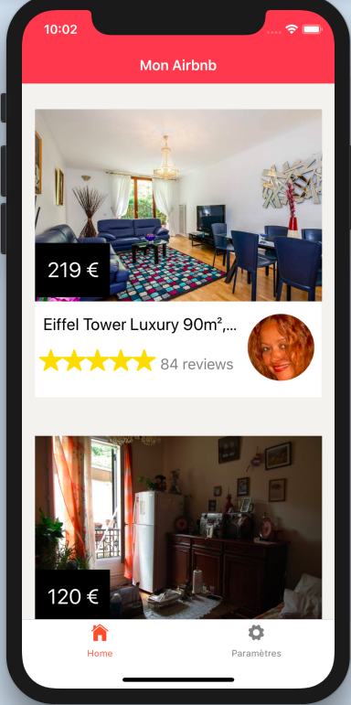

# Airbnb-React-Native

## General info

Project done during training to learn about some basic ReactNative concepts.

## Installation

Make sure that you have previously installed Expo https://docs.expo.io/versions/latest/.

* Clone the repository 

		https://github.com/CamilleGvd/Airbnb-React-Native.gitcd 

* Add dependencies

		npm install

* Run the app

		npm start
		

## Screenshots

  

  

## Status

Project is *finished*.

## Inspiration

Design and functionalities of this project are based on official Airbnb app.
